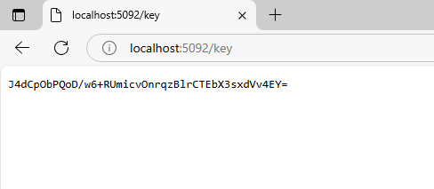
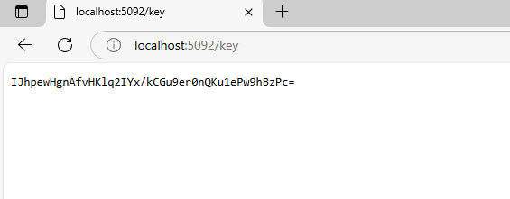
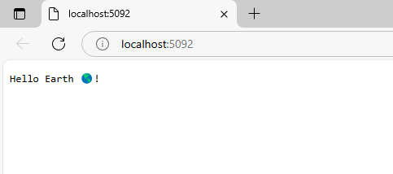

# Web_Api_AES_ENDE_Crypt

## Overview

This project is a minimal ASP.NET Core Web API that provides AES encryption and decryption services while securely managing encryption keys.
The system generates a random AES-256 key, stores it in an Excel file, and allows encryption and decryption using this key.

--- 
 <!-- Step 1 -->

### Initial Setup

1. First, make a directory to work in using:

```bash
mkdir dotnet_Api
```

2. Go to the folder we just created:

```bash
cd dotnet_Api
```

3. Create a folder to work directly in with the command:

```bash
mkdir Web_Api_AES_ENDE_Crypt
```

4. Move into the new folder using:

```bash
cd Web_Api_AES_ENDE_Crypt
```

5. Created the project using:

```bash
dotnet new web
```

6. Opened the project in Visual Studio:

```bash
start devenv .
```
> [!NOTE]
> Opened the project in VS Code:

```bash
code .
```
7. Generated a `.gitignore` file using:

```bash
dotnet new gitignore
```

   This was done to ensure that certain files and folders, such as `bin/` and `obj/` directories, are not added to version control. These folders contain build artifacts and temporary files that do not need to be tracked in Git.

8. Added a `README.md` file:

```bash
echo "# Web_Api_AES_ENDE_Crypt" >> README.md
```
9. Created a new repository on GitHub:

    - Go to GitHub and click on **New Repository**.
    - Name the repository `KYH_Web_Api_AES_ENDE_Crypt`.
    - Check the box to add a **README file**, as this will help with immediate repository documentation.
    - Do not add a **.gitignore** or **license** since they already exist locally.

--- 

 <!-- Step 2 -->

1. Initialized a new Git repository:

```bash
git init
```

2. Staged all files for the initial commit:

```bash
git add .
```

3. Created the first commit with the `README.md` file:

```bash
git commit -m "first commit"
```

4. Renamed the default branch to `main`:

```bash
git branch -M main
```

5. Added the remote repository:

```bash
git remote add origin https://github.com/WANTEDSIMON/KYH_Web_Api_AES_ENDE_Crypt.git
```

6. Pushed the code to GitHub:

```bash
git push -u origin main
```
---

 <!-- Step 3 -->

1. Update the `README.md` file with the change History from Step.1 later Step.2.
 
2. Created a new branch "change.1" for the project:
 ```bash
 git checkout -b change.1
 ```
3. Staged the file for the initial commit, used command:

```bash
git add .
```
4. Create commit message with the changes made:
```bash
git commit -m "Change ReadMe"
```
5. Pushed the code to GitHub:
```bash
git push origin change.1
```

---

 <!-- Step 4 -->

 1. Created a new branch "change.2" for the project regarding change History from step.2.
  ```bash
 git checkout -b change.2
 ```

 2. Staged the file for the initial commit, used command:
```bash
git add .
```

3. Create commit message with the changes made:
```bash
git commit -m "Updated ReadMe Change"
```

4. Pushed the code to GitHub:
```bash
git push origin change.2
```

---

 <!-- Step 5 -->

 1. Created a new branch "change.3" for the project regarding adding previous changes from ReadMe.
  ```bash
 git checkout -b change.3
 ```

 2. Staged the file for the initial commit, used command:
```bash
git add .
```

3. Create commit message with the changes made:
```bash
git commit -m "Added previous changes from ReadMe"
```

4. Pushed the code to GitHub:
```bash
git push origin change.3
```

---

 <!-- Step 6 -->

1. Created a new branch "dev.1" for first change in *Program.cs*.
  ```bash
 git checkout -b dev.1
 ```

2. Updated the default endpoint "app.MapGet("/", () => "Hello World!");" to "app.MapGet("/", () => "Hell Earth 🌎!");".
```bash
app.MapGet("/", () => "Hell Earth 🌎!");
```

3. Staged the file for the initial commit, used command:
```bash
git add git add Program.cs
```

4. Create commit message with the changes made:
```bash
git commit -m "Updated default endpoint"
```

5. Pushed the code to GitHub:
```bash
git push origin dev.1
```

---

 <!-- Step 7 -->

1. Created a new branch "change.4" to include ReadMe changes from change in *Program.cs* - dev.1 Branch.
  ```bash
  git checkout -b change.4
  ```

2. Staged the file for the initial commit, used command:
```bash
git add .
```

3. Create commit message with the changes made:
```bash
git commit -m "Updated ReadMe"
```

4. Pushed the code to GitHub:
```bash
git push origin change.4
```

 <!-- Extra 1 -->

1. Change spelling mistake in ReadMe file + *Program.cs*
  ```bash
  git checkout -b change.5
  ```
2. Fix the hell earth to hello earth in *Program.cs*.
  ```bash
  //First change the endpoint from:
  app.MapGet("/", () => "Hell Earth 🌎!");
  
  //Updated to:
  To: app.MapGet("/", () => "Hello Earth 🌎!");
  ```
3. Staged the files for the initial commit, used command:
Programe.cs
&
ReadMe.md

4. Write a commit message with the changes made:
```bash
git commit -m "Fixed spelling mistake + New Readme History"
```

5. Pushed the code to GitHub:
```bash
git push origin change.5
```
---

 <!-- Step 8 -->

 1. add a new branch "dev.2" for the project regarding adding a new endpoint in *Program.cs*.
  ```bash
  git checkout -b dev.2
  ```

2. Add the new enpoint mapping to *Program.cs*.
  ```bash
  app.MapGet("/key", () => GenerateRandomKey());
  ```

3. Plus the method to generate a random key.
  ```bash
  private static string GenerateRandomKey()
  {
      byte[] key = new byte[32];
      using (var rng = new RNGCryptoServiceProvider())
      {
          rng.GetBytes(key);
      }
      return Convert.ToBase64String(key);
  }
  ```

4. Add image folder and image to the project.
```bash
mkdir images_readme
```

5. Run the code to check if the new endpoint is working.
Here is the output as a photo:



If you refresh the page, you will get a new key generated each time.

Photo 2:



6. And here is the output as a text from Hello Earth:



7. Staged the files for the initial commit, used command:
```bash
git add program.cs
```

8. Write a commit message with the changes made:
```bash
git commit -m "Added new endpoint to generate random key"
```

9. Pushed the code to GitHub:
```bash
git push origin dev.2
```

10. Make bransh for ReadMe changes from dev.2.
```bash
 git checkout -b change.6
```